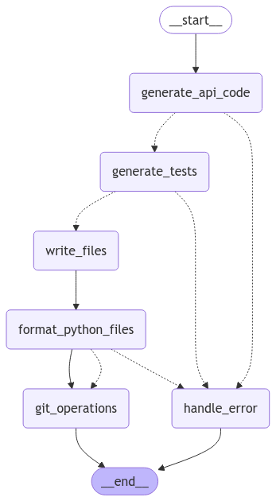

# LLM Software Forge Factory (LSFF)

An automated system that generates and implements Python REST API features using LangGraph and Llama. LSFF reads feature descriptions from a database, generates the implementation and tests, and automatically commits the changes to git.

## Features

* Automated API endpoint generation from natural language descriptions
* Automated test generation and implementation
* Continuous feature implementation from a database queue
* Built-in git integration for automatic commits and pushes
* Comprehensive logging system for long-running deployments

## Prerequisites

* Python 3.10+
* Git repository setup
* Llama model in GGUF format
* SQLite database

## Installation

```bash
# Clone the repository
git clone [repository-url]
cd llm-software-forge-factory

# Create and activate virtual environment
python -m venv .venv
source .venv/bin/activate  # On Windows: .venv\Scripts\activate

# Install dependencies
pip install -r requirements.txt

# Install Llama backend (choose one based on your system)
# For CPU:
pip install llama-cpp-python

# For CUDA:
CMAKE_ARGS="-DLLAMA_CUBLAS=on" FORCE_CMAKE=1 pip install llama-cpp-python

# For Metal (MacOS):
CMAKE_ARGS="-DLLAMA_METAL=on" FORCE_CMAKE=1 pip install llama-cpp-python
```

## Configuration

1. Set up your database with the required schema:
```sql
CREATE TABLE feature_prompts (
    id INTEGER PRIMARY KEY,
    description TEXT NOT NULL,
    is_implemented BOOLEAN DEFAULT FALSE
);
```

2. Configure environment variables or update config files:
```bash
# Example .env file
DB_CONNECTION_PATH="path/to/your/database.db"
MODEL_PATH="path/to/your/llama-model.gguf"
```

## Usage

### Run as a Service

```bash
# Using systemd (recommended for Linux servers)
sudo cp lsff.service /etc/systemd/system/
sudo systemctl start lsff
sudo systemctl enable lsff

# Check status
sudo systemctl status lsff

# View logs
journalctl -u lsff -f
```

### Run Manually

```bash
python api-agent.py
```

Output logs will be saved in the `logs` directory with timestamps:
* `lsff_YYYYMMDD_HHMMSS_stdout.log`
* `lsff_YYYYMMDD_HHMMSS_stderr.log`
* `lsff_YYYYMMDD_HHMMSS_debug.log`

## Architecture

LSFF uses LangGraph to create a workflow with the following nodes:

1. `generate_api_code`: Creates FastAPI implementation based on feature description
2. `generate_tests`: Generates corresponding pytest files
3. `write_files`: Saves the generated code to disk
4. `git_operations`: Commits and pushes changes to the repository



## Contributing

1. Fork the repository
2. Create your feature branch (`git checkout -b feature/amazing-feature`)
3. Commit your changes (`git commit -m 'Add amazing feature'`)
4. Push to the branch (`git push origin feature/amazing-feature`)
5. Open a Pull Request

## License

MIT License

## Acknowledgments

* LangGraph for the workflow framework
* deepseek-r1:7b for the language model
* FastAPI community for API patterns and best practices

## Running script

```
nohup python api-agent.py > /dev/null 2>&1 &
```